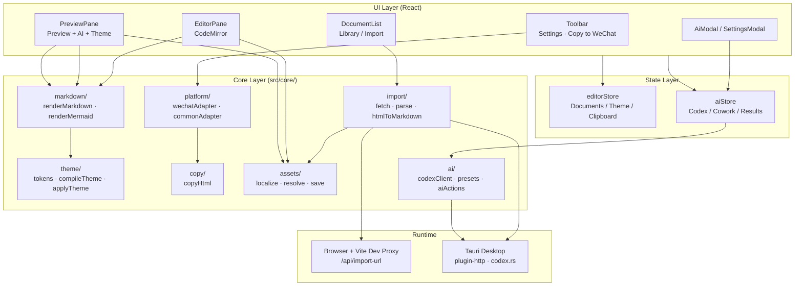

# Read2MD Studio

**Languages:** [中文](README.md) | English

A lightweight Markdown publishing workbench: write, preview in real time, apply themes, and copy HTML ready for rich-text platforms such as WeChat Official Accounts.

[](https://github.com/ingeniousfrog/Read2MD-Studio/releases)
[](LICENSE)

**Core workflow:**

```text
Markdown editing → Live preview → Theme styling → Platform HTML → Clipboard
```

Available as a **Web app** (browser) and **macOS desktop app** (Tauri). Business logic lives in the TypeScript `core/` layer; the UI only composes and interacts—making it easy to add adapters for Zhihu, Juejin, and other platforms later.

### Web vs desktop

| Capability | Web | Desktop (Tauri) |
|------------|-----|-----------------|
| Markdown edit / preview / themes | ✅ | ✅ |
| Copy to WeChat | ✅ | ✅ |
| URL import (with image localization) | Dev proxy only; production needs your own API | ✅ Native HTTP, no CORS |
| **AI assistant (local Codex)** | ❌ **Not available** | ✅ |

**The AI assistant is desktop-only.** It invokes the locally installed [Codex CLI](https://github.com/openai/codex) (`codex login` / `codex exec`) through Tauri. Browsers cannot spawn local processes for security reasons, so visiting `http://127.0.0.1` via `npm run dev` **does not** enable AI. Use `npm run tauri:dev` or install the `.dmg` instead.

---

## Download

| Platform | Notes |
|----------|-------|
| [GitHub Releases](https://github.com/ingeniousfrog/Read2MD-Studio/releases) | macOS arm64 `.dmg` (Apple Silicon) |
| Web | Run `npm run dev` locally, or `npm run build` and deploy `dist/` |

The desktop build is **ad-hoc signed and not notarized**. If Safari shows “damaged” or the app won’t open after download, run this in Terminal and try again:

```bash
xattr -cr /Applications/Read2MD-Studio.app
```

You can also **right-click Read2MD-Studio → Open** in Applications (confirm once on first launch). If it still fails, remove the old app and reinstall the latest dmg from Releases.

---

## Features

- **Editor**: CodeMirror 6 with Markdown syntax highlighting; **paste / drag-and-drop images** into local assets
- **Preview**: `markdown-it` rendering, MathJax SVG math, highlight.js code blocks; **live Mermaid diagrams** (with auto-fix for bracket labels in node text)
- **Themes**: Built-in `clean` / `tech` / `wechat-card`, custom tokens, JSON import/export, dynamic heading levels (H1–H6 add/remove)
- **Document library**: Multi-document management; drafts and theme settings auto-saved to `localStorage`
- **URL import**: WeChat articles / generic pages → Markdown (math and code blocks preserved; WeChat HTML keeps tables, blockquotes, styled headings when possible)
- **Image localization**: External images downloaded to `assets/{docId}/` on import; Markdown uses `r2md-asset:` URLs; preview resolves them and assets are removed when a document is deleted
- **WeChat copy**: CSS inlining, HTML sanitization, math SVG protection, external images inlined as data URLs when possible
- **Desktop**: Tauri native window; URL import via HTTP plugin without browser CORS; local images previewed via the asset protocol
- **AI assistant (desktop only)**: Entry on the Preview header; calls the local Codex CLI for paper structuring, Mermaid diagrams, style rewriting, and an editable Cowork pipeline; live run logs and per-step result history
- **Layout**: Toolbar, document sidebar, and pane headers stay fixed; only editor and preview content scroll

### Desktop AI assistant (0.2.0)

| Module | Description |
|--------|-------------|
| **Entry** | **AI assistant** on the Preview header (same row as theme picker); pulsing dot while running |
| **Settings** | Toolbar **Settings** → Codex path auto-detect, OAuth login/logout, per-capability model (Academic / Mermaid / Roleplay / Cowork) |
| **Academic** | Structure, summarize, table of contents |
| **Mermaid** | Flowchart, sequence, mindmap; preview renders ` ```mermaid ` blocks |
| **Style rewrite** | Academic, WeChat relaxed tone, Xiaohongshu, tech evangelist, custom style |
| **Cowork pipeline** | Multi-step publish flow; edit action, reorder, add/remove steps; **Run all** / **Restore default**; config persisted locally |
| **Feedback** | Terminal-style run log; tabbed result history; apply to doc (append / replace / new document) |

**Prerequisites:** Install [Codex CLI](https://github.com/openai/codex) locally. A green **Logged in** status in Settings means you are ready—re-login only when the session expires.

---

## Changelog

### v0.2.0 (current)

- **AI assistant** on desktop via local Codex CLI (`codex login` / `codex exec`); not available on Web
- AI entry moved to **Preview header**; toolbar keeps Settings and Copy to WeChat
- **Settings modal**: Codex login status, path detection, per-capability models
- **Cowork pipeline**: editable steps (action, order, add/remove, restore default), run all, persisted config
- **Run log** and **result history**; review each Cowork step separately
- **Mermaid preview** with auto-quoting for labels containing brackets (e.g. `dp[i]`)
- Copy updates: “WeChat · relaxed tone” and related labels

### v0.1.0

- Initial release: Markdown edit/preview/themes, WeChat copy, URL import, image localization, macOS dmg

---

## Architecture

The project has four layers: **UI components**, **state**, **core business logic**, and **runtime**.



### Directory layout

```text
src/
  App.tsx                 # Layout: toolbar + doc sidebar + editor/preview split
  components/             # Pure UI; no business rules
    DocumentList.tsx      # Doc list, URL import, rename/delete menu
    EditorPane.tsx        # Markdown editor (paste/drag images)
    editorImageExtension.ts
    PreviewPane.tsx       # Preview + AI entry + theme picker/config
    ThemePanel.tsx        # Categorized theme config panel
    HeadingLevelsEditor.tsx
    Toolbar.tsx           # Settings + Copy to WeChat
    AiModal.tsx           # AI assistant (Cowork, run log, result history)
    SettingsModal.tsx     # Codex login and model config
    AiResultActions.tsx   # Apply results: append / replace / new doc
    WorkspaceSplit.tsx    # Draggable split pane
  core/
    ai/                   # Codex client, presets, action runner
    markdown/             # Markdown → HTML, math and Mermaid
    theme/                # Theme tokens, CSS compile, wrap HTML
    platform/             # Platform adapters (currently WeChat)
    copy/                 # Clipboard write
    import/               # URL fetch, HTML parse, to Markdown
    assets/               # Image download, localization, preview resolve, paste save
    document/             # Document type definitions
  store/
    editorStore.ts        # Zustand global state + localStorage persistence
    aiStore.ts            # Codex state, Cowork pipeline, AI result history
  styles/
    globals.css
server/                   # Dev only: Node fetch scripts for Vite middleware
src-tauri/                # Tauri desktop shell (Rust, includes codex.rs)
```

**Design principle:** React components only call `core/` APIs. Rendering, themes, platform adaptation, sanitization, and clipboard logic stay decoupled from the UI for easier testing and extension.

---

## Core data flows

### 1. Preview rendering

```text
Markdown
  → renderMarkdown()        # markdown-it + custom mathPlugin
  → rawHtml
  → applyThemeHtml()        # wrap .r2md-article + theme CSS
  → Preview DOM
```

Math is rendered as **self-contained SVG** via MathJax (`fontCache: "none"`) so pasted content does not lose `<use>` references.

### 2. Copy to WeChat

```text
rawHtml
  → applyThemeHtml()
  → buildWechatOutput()
      ① Extract math containers as blocks (avoid nested SVG breakage)
      ② juice inline CSS
      ③ DOMPurify sanitize
      ④ Try external images → data URLs
      ⑤ Restore math HTML
  → copyHtml()              # Write text/html + text/plain
```

The preview DOM is **not** copied directly. Each “Copy to WeChat” click runs the pipeline above for consistent output.

### 3. URL import

```text
User enters URL
  → fetchImportUrl()
      Browser: /api/import-url (Vite → server/*.mjs)
      Desktop: @tauri-apps/plugin-http
  → parseWechatHtml() / parseGenericHtml()
      Extract code blocks, math placeholders
  → htmlToMarkdown()        # Sitdown + Turndown
  → localizeDocumentImages() # Download external images to assets/{docId}/
  → Write to editor
```

### 4. Image assets

```text
Import external images / editor paste·drop
  → localizeDocumentImages() / saveUserImage()
      Desktop: AppData/read2md-studio/assets/{docId}/
      Web dev: IndexedDB
  → Markdown references r2md-asset:image-001.webp
  → Preview resolveMarkdownAssetUrls() → convertFileSrc (desktop asset protocol)
  → Copy inlineAssets() tries data URL conversion
  → Delete document → deleteDocumentAssetsDir()
```

---

## Usage

### Web

```bash
npm install
npm run dev -- --host 127.0.0.1 --port 3000
```

Open http://127.0.0.1:3000/

1. Write or paste Markdown in the left editor (**paste / drag images** supported)
2. See live preview on the right
3. Pick a theme at the top of the preview; use “Theme config” to fine-tune
4. Click **“Copy to WeChat”** in the toolbar
5. Paste into the WeChat backend or another rich-text editor

**URL import:** Document sidebar → Import → paste article URL. In dev mode, a local proxy fetches the page; for production Web deploy you need an equivalent API or use the desktop app. For image-heavy articles, prefer the **desktop app** so WeChat images are fully localized.

**AI assistant:** Not available on Web. The Preview header “AI assistant” button is disabled in the browser.

### Desktop (macOS)

**Requirements:** [Rust](https://www.rust-lang.org/tools/install) 1.77+, Xcode Command Line Tools

```bash
# Development
npm run tauri:dev

# Build dmg
npm run tauri:build
# Output: src-tauri/target/release/bundle/dmg/Read2MD-Studio_0.2.0_aarch64.dmg
```

Current version: **0.2.0**. Pre-built dmg: [Releases](https://github.com/ingeniousfrog/Read2MD-Studio/releases).

**AI assistant:** Requires Codex CLI installed locally (`codex --version`). First run: toolbar **Settings** → **Log in to Codex** (browser OAuth). When Settings shows a green **Logged in** status, you are ready. Open **AI assistant** from the Preview header; pick a model per capability in Settings.

### Production build (Web)

```bash
npm run build    # Output dist/
npm run preview  # Preview dist locally
```

---

## Development commands

| Command | Description |
|---------|-------------|
| `npm run dev` | Start Vite dev server |
| `npm run build` | TypeScript check + production build |
| `npm run preview` | Preview production build |
| `npm run tauri:dev` | Tauri dev mode (native window) |
| `npm run tauri:build` | Build macOS dmg |

---

## Acknowledgments

This project builds on many excellent open-source libraries:

| Project | Role |
|---------|------|
| [markdown-it](https://github.com/markdown-it/markdown-it) | Markdown parse and HTML render |
| [MathJax](https://github.com/mathjax/MathJax) | LaTeX → SVG |
| [CodeMirror](https://github.com/codemirror/dev) / [react-codemirror](https://github.com/uiwjs/react-codemirror) | Editor core and React binding |
| [highlight.js](https://github.com/highlightjs/highlight.js) | Code block highlighting |
| [juice](https://github.com/Automattic/juice) | CSS inlining (required for WeChat rich text) |
| [DOMPurify](https://github.com/cure53/DOMPurify) | HTML sanitization before copy |
| [Sitdown](https://github.com/mdnice/sitdown) | WeChat / Zhihu HTML → Markdown |
| [Turndown](https://github.com/mixmark-io/turndown) | Generic HTML → Markdown |
| [Tauri](https://github.com/tauri-apps/tauri) | Cross-platform desktop shell |
| [Mermaid](https://github.com/mermaid-js/mermaid) | Flowchart / sequence preview rendering |
| [Codex CLI](https://github.com/openai/codex) | Desktop AI backend (installed by user) |
| [React](https://github.com/facebook/react) · [Vite](https://github.com/vitejs/vite) · [Zustand](https://github.com/pmndrs/zustand) | UI, bundler, state |

If we missed anyone, please open an Issue.

---

## License

This project is licensed under the [Apache License 2.0](LICENSE).

Third-party packages have their own licenses; keep the `LICENSE` file when redistributing.

---

## Current limitations

- **AI assistant is not available on Web**: It depends on the local Codex CLI and Tauri process bridge; browsers cannot call local Codex directly
- **Mermaid → WeChat copy**: Diagrams render in preview, but copy-to-WeChat still pastes Mermaid as code/text, not as embedded images/SVG
- **Cowork custom style**: If a pipeline step uses “Custom style”, fill in the style description under the **Style rewrite** tab in the AI modal first
- **No image CDN yet**: Desktop and Web dev can store images as local `assets` (download on import, paste to insert), but some external images may still fail to inline when copying to WeChat due to CORS—manual upload in the backend may be needed
- **Production Web deploy** has no URL fetch proxy or full image localization; use the desktop app for image-heavy workflows
- Only WeChat copy adapter implemented; Zhihu / Juejin etc. planned
- No cloud sync or user accounts; drafts and images stay on the local machine
- Desktop dmg is ad-hoc signed and not notarized
- Some WeChat article imports may trigger environment verification depending on network
