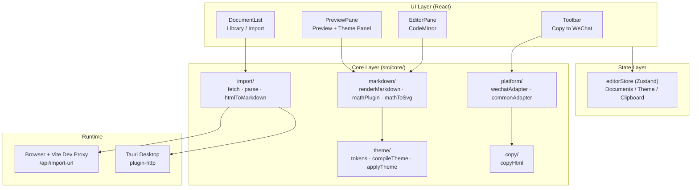

# Read2MD Studio

**Languages:** [中文](README.md) | English

A lightweight Markdown publishing workbench: write, preview in real time, apply themes, and copy HTML ready for rich-text platforms such as WeChat Official Accounts.

[](https://github.com/ingeniousfrog/Read2MD-Studio/releases)
[](LICENSE)

**Core workflow:**

```text
Markdown editing → Live preview → Theme styling → Platform HTML → Clipboard
```

Available as a **Web app** (browser) and **macOS desktop app** (Tauri). Business logic lives in the TypeScript `core/` layer; the UI only composes and interacts—making it easy to add adapters for Zhihu, Juejin, and other platforms later.

---

## Download

| Platform | Notes |
|----------|-------|
| [GitHub Releases](https://github.com/ingeniousfrog/Read2MD-Studio/releases) | macOS arm64 `.dmg` (Apple Silicon) |
| Web | Run `npm run dev` locally, or `npm run build` and deploy `dist/` |

The desktop build is **ad-hoc signed and not notarized**. If Safari shows “damaged” or the app won’t open after download, run this in Terminal and try again:

```bash
xattr -cr /Applications/Read2MD-Studio.app
```

You can also **right-click Read2MD-Studio → Open** in Applications (confirm once on first launch). If it still fails, remove the old app and reinstall the latest dmg from Releases.

---

## Features

- **Editor**: CodeMirror 6 with Markdown syntax highlighting
- **Preview**: `markdown-it` rendering, MathJax SVG math, highlight.js code blocks
- **Themes**: Built-in `clean` / `tech` / `wechat-card`, custom tokens, JSON import/export, dynamic heading levels (H1–H6 add/remove)
- **Document library**: Multi-document management; drafts and theme settings auto-saved to `localStorage`
- **URL import**: WeChat articles / generic pages → Markdown (with math and code block preservation)
- **WeChat copy**: CSS inlining, HTML sanitization, math SVG protection, external images inlined when possible
- **Desktop**: Tauri native window; URL import via HTTP plugin without browser CORS limits

---

## Architecture

The project has four layers: **UI components**, **state**, **core business logic**, and **runtime**.



### Directory layout

```text
src/
  App.tsx                 # Layout: toolbar + doc sidebar + editor/preview split
  components/             # Pure UI; no business rules
    DocumentList.tsx      # Doc list, URL import, rename/delete menu
    EditorPane.tsx        # Markdown editor
    PreviewPane.tsx       # Preview + theme picker/config entry
    ThemePanel.tsx        # Categorized theme config panel
    HeadingLevelsEditor.tsx
    Toolbar.tsx           # Copy to WeChat
    WorkspaceSplit.tsx    # Draggable split pane
  core/
    markdown/             # Markdown → HTML, math plugin
    theme/                # Theme tokens, CSS compile, wrap HTML
    platform/             # Platform adapters (currently WeChat)
    copy/                 # Clipboard write
    import/               # URL fetch, HTML parse, to Markdown
    document/             # Document type definitions
  store/
    editorStore.ts        # Zustand global state + localStorage persistence
  styles/
    globals.css
server/                   # Dev only: Node fetch scripts for Vite middleware
src-tauri/                # Tauri desktop shell (Rust)
```

**Design principle:** React components only call `core/` APIs. Rendering, themes, platform adaptation, sanitization, and clipboard logic stay decoupled from the UI for easier testing and extension.

---

## Core data flows

### 1. Preview rendering

```text
Markdown
  → renderMarkdown()        # markdown-it + custom mathPlugin
  → rawHtml
  → applyThemeHtml()        # wrap .r2md-article + theme CSS
  → Preview DOM
```

Math is rendered as **self-contained SVG** via MathJax (`fontCache: "none"`) so pasted content does not lose `<use>` references.

### 2. Copy to WeChat

```text
rawHtml
  → applyThemeHtml()
  → buildWechatOutput()
      ① Extract math containers as blocks (avoid nested SVG breakage)
      ② juice inline CSS
      ③ DOMPurify sanitize
      ④ Try external images → data URLs
      ⑤ Restore math HTML
  → copyHtml()              # Write text/html + text/plain
```

The preview DOM is **not** copied directly. Each “Copy to WeChat” click runs the pipeline above for consistent output.

### 3. URL import

```text
User enters URL
  → fetchImportUrl()
      Browser: /api/import-url (Vite → server/*.mjs)
      Desktop: @tauri-apps/plugin-http
  → parseWechatHtml() / parseGenericHtml()
      Extract code blocks, math placeholders
  → htmlToMarkdown()        # Sitdown + Turndown
  → Write to editor
```

---

## Usage

### Web

```bash
npm install
npm run dev -- --host 127.0.0.1 --port 3000
```

Open http://127.0.0.1:3000/

1. Write or paste Markdown in the left editor
2. See live preview on the right
3. Pick a theme at the top of the preview; use “Theme config” to fine-tune
4. Click **“Copy to WeChat”** in the toolbar
5. Paste into the WeChat backend or another rich-text editor

**URL import:** Document sidebar → Import → paste article URL. In dev mode, a local proxy fetches the page; for production Web deploy you need an equivalent API or use the desktop app.

### Desktop (macOS)

**Requirements:** [Rust](https://www.rust-lang.org/tools/install) 1.77+, Xcode Command Line Tools

```bash
# Development
npm run tauri:dev

# Build dmg
npm run tauri:build
# Output: src-tauri/target/release/bundle/dmg/Read2MD-Studio_0.1.0_aarch64.dmg
```

Or download a pre-built dmg from [Releases](https://github.com/ingeniousfrog/Read2MD-Studio/releases).

### Production build (Web)

```bash
npm run build    # Output dist/
npm run preview  # Preview dist locally
```

---

## Development commands

| Command | Description |
|---------|-------------|
| `npm run dev` | Start Vite dev server |
| `npm run build` | TypeScript check + production build |
| `npm run preview` | Preview production build |
| `npm run tauri:dev` | Tauri dev mode (native window) |
| `npm run tauri:build` | Build macOS dmg |

---

## Acknowledgments

This project builds on many excellent open-source libraries:

| Project | Role |
|---------|------|
| [markdown-it](https://github.com/markdown-it/markdown-it) | Markdown parse and HTML render |
| [MathJax](https://github.com/mathjax/MathJax) | LaTeX → SVG |
| [CodeMirror](https://github.com/codemirror/dev) / [react-codemirror](https://github.com/uiwjs/react-codemirror) | Editor core and React binding |
| [highlight.js](https://github.com/highlightjs/highlight.js) | Code block highlighting |
| [juice](https://github.com/Automattic/juice) | CSS inlining (required for WeChat rich text) |
| [DOMPurify](https://github.com/cure53/DOMPurify) | HTML sanitization before copy |
| [Sitdown](https://github.com/mdnice/sitdown) | WeChat / Zhihu HTML → Markdown |
| [Turndown](https://github.com/mixmark-io/turndown) | Generic HTML → Markdown |
| [Tauri](https://github.com/tauri-apps/tauri) | Cross-platform desktop shell |
| [React](https://github.com/facebook/react) · [Vite](https://github.com/vitejs/vite) · [Zustand](https://github.com/pmndrs/zustand) | UI, bundler, state |

If we missed anyone, please open an Issue.

---

## License

This project is licensed under the [Apache License 2.0](LICENSE).

Third-party packages have their own licenses; keep the `LICENSE` file when redistributing.

---

## Current limitations

- No image upload / CDN; external images rely on inlining or manual upload
- Only WeChat copy adapter implemented; Zhihu / Juejin etc. planned
- No cloud sync or user accounts
- Desktop dmg is unsigned and not notarized
- Some WeChat article imports may trigger environment verification depending on network
