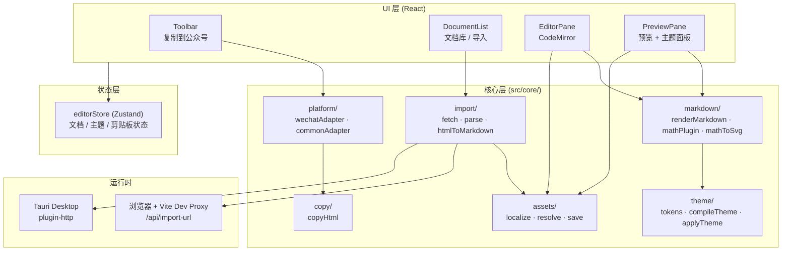

# Read2MD Studio

**语言 / Languages：** 中文 | [English](README-EN.md)

轻量级 Markdown 发布工作台：写作、实时预览、主题排版，并一键复制适合公众号等富文本平台的 HTML。

[](https://github.com/ingeniousfrog/Read2MD-Studio/releases)
[](LICENSE)

**核心工作流：**

```text
Markdown 编辑 → 实时预览 → 主题样式 → 平台适配 HTML → 剪贴板
```

提供 **Web 版**（浏览器访问）和 **macOS 桌面版**（Tauri 打包）。业务逻辑集中在 TypeScript `core/` 层，UI 只负责组合与交互，便于后续扩展知乎、掘金等平台适配器。

---

## 下载

| 平台 | 说明 |
|------|------|
| [GitHub Releases](https://github.com/ingeniousfrog/Read2MD-Studio/releases) | macOS arm64 `.dmg`（Apple Silicon） |
| Web | `npm run dev` 本地启动，或自行 `npm run build` 后部署 `dist/` |

桌面版当前为 **ad-hoc 签名、未公证**。若 Safari 下载后提示「已损坏」或无法打开，请在终端执行后重试：

```bash
xattr -cr /Applications/Read2MD-Studio.app
```

也可在「应用程序」中 **右键 Read2MD-Studio → 打开**（首次需确认一次）。若仍失败，删除旧版后重新从 Releases 下载最新 dmg 安装。

---

## 功能概览

- **编辑器**：CodeMirror 6 + Markdown 语法高亮；支持 **粘贴 / 拖放图片** 插入本地资源
- **预览**：`markdown-it` 渲染，MathJax SVG 公式，highlight.js 代码高亮
- **主题**：内置 `clean` / `tech` / `wechat-card`，支持自定义 token、JSON 导入导出、动态标题级别（H1–H6 可增删）
- **文档库**：多文档管理，草稿与主题配置自动保存至 `localStorage`
- **URL 导入**：公众号文章 / 通用网页 → Markdown（含公式、代码块保护；公众号 HTML 尽量保留表格、引用块、彩色标题等样式）
- **图片本地化**：导入时自动下载外链图至每篇文档的 `assets/{docId}/`；Markdown 使用 `r2md-asset:` 引用，预览与删除文档时自动解析 / 清理
- **公众号复制**：CSS 内联、HTML 消毒、公式 SVG 保护、外链图片尝试内嵌为 data URL
- **桌面端**：Tauri 原生窗口，URL 导入走 HTTP 插件，无浏览器 CORS 限制；本地图片通过 asset 协议预览
- **布局**：顶部工具栏、左侧文档边栏与各面板标题栏固定，仅编辑区 / 预览正文滚动

---

## 架构

项目分为四层：**UI 组件**、**状态管理**、**核心业务**、**运行时**。



### 目录结构

```text
src/
  App.tsx                 # 布局：工具栏 + 文档侧栏 + 编辑/预览分栏
  components/             # 纯 UI 组件，不含业务规则
    DocumentList.tsx      # 文档列表、URL 导入入口、重命名/删除菜单
    EditorPane.tsx        # Markdown 编辑器（含图片粘贴/拖放）
    editorImageExtension.ts
    PreviewPane.tsx       # 预览区 + 主题选择/配置入口
    ThemePanel.tsx        # 分类主题配置面板
    HeadingLevelsEditor.tsx
    Toolbar.tsx           # 复制到公众号
    WorkspaceSplit.tsx    # 可拖拽分栏
  core/
    markdown/             # Markdown → HTML，含公式插件
    theme/                # 主题 token、CSS 编译、包裹 HTML
    platform/             # 平台适配（当前：微信公众号）
    copy/                 # 剪贴板写入
    import/               # URL 抓取、HTML 解析、转 Markdown
    assets/               # 图片下载、本地化、预览解析、用户粘贴保存
    document/             # 文档类型定义
  store/
    editorStore.ts        # Zustand 全局状态 + localStorage 持久化
  styles/
    globals.css
server/                   # 仅开发态：Vite 中间件调用的 Node 抓取脚本
src-tauri/                # Tauri 桌面壳（Rust）
```

**设计原则：** React 组件只调用 `core/` 接口；渲染、主题、平台适配、消毒、剪贴板逻辑均与 UI 解耦，方便单独测试和扩展。

---

## 核心数据流

### 1. 预览渲染

```text
Markdown
  → renderMarkdown()        # markdown-it + 自定义 mathPlugin
  → rawHtml
  → applyThemeHtml()        # 包裹 .r2md-article + 主题 CSS
  → 预览区 DOM
```

公式由 MathJax 输出为 **自包含 SVG**（`fontCache: "none"`），避免粘贴后 `<use>` 引用丢失。

### 2. 复制到公众号

```text
rawHtml
  → applyThemeHtml()
  → buildWechatOutput()
      ① 整块提取公式容器（避免嵌套 SVG 被拆碎）
      ② juice 内联 CSS
      ③ DOMPurify 消毒
      ④ 外链图片尝试转 data URL
      ⑤ 还原公式 HTML
  → copyHtml()              # 同时写入 text/html + text/plain
```

预览区 DOM **不会**被直接复制；每次点击「复制到公众号」都会重新走上述管线，保证输出一致。

### 3. URL 导入

```text
用户输入 URL
  → fetchImportUrl()
      浏览器：/api/import-url（Vite → server/*.mjs）
      桌面端：@tauri-apps/plugin-http
  → parseWechatHtml() / parseGenericHtml()
      提取代码块、公式占位符
  → htmlToMarkdown()        # Sitdown + Turndown
  → localizeDocumentImages() # 外链图下载至 assets/{docId}/
  → 写入编辑器
```

### 4. 图片资源

```text
导入外链图 / 编辑器粘贴·拖放
  → localizeDocumentImages() / saveUserImage()
      桌面端：AppData/read2md-studio/assets/{docId}/
      Web 开发态：IndexedDB
  → Markdown 引用 r2md-asset:image-001.webp
  → 预览 resolveMarkdownAssetUrls() → convertFileSrc（桌面 asset 协议）
  → 复制时 inlineAssets() 尝试转为 data URL
  → 删除文档 → deleteDocumentAssetsDir()
```

---

## 使用指南

### Web 版

```bash
npm install
npm run dev -- --host 127.0.0.1 --port 3000
```

打开 http://127.0.0.1:3000/

1. 在左侧编辑器撰写或粘贴 Markdown（可直接 **粘贴 / 拖放图片**）
2. 右侧查看实时预览
3. 在预览区顶部选择主题，点击「主题配置」微调样式
4. 点击工具栏 **「复制到公众号」**
5. 粘贴到公众号后台或其他富文本编辑器

**URL 导入：** 文档侧栏 → 导入 → 粘贴文章链接。开发模式下由本地代理抓取；生产 Web 部署需自行提供等效 API，或改用桌面版。含图文章建议使用 **桌面版** 导入，以完整本地化微信图片。

### 桌面版（macOS）

**依赖：** [Rust](https://www.rust-lang.org/tools/install) 1.77+、Xcode Command Line Tools

```bash
# 开发
npm run tauri:dev

# 打包 dmg
npm run tauri:build
# 产物：src-tauri/target/release/bundle/dmg/Read2MD-Studio_0.1.0_aarch64.dmg
```

也可直接从 [Releases](https://github.com/ingeniousfrog/Read2MD-Studio/releases) 下载已构建的 dmg。

### 生产构建（Web）

```bash
npm run build    # 输出 dist/
npm run preview  # 本地预览 dist
```

---

## 开发命令

| 命令 | 说明 |
|------|------|
| `npm run dev` | 启动 Vite 开发服务器 |
| `npm run build` | TypeScript 检查 + 生产构建 |
| `npm run preview` | 预览生产构建 |
| `npm run tauri:dev` | Tauri 开发模式（原生窗口） |
| `npm run tauri:build` | 构建 macOS dmg |

---

## 致谢

本项目站在诸多优秀开源项目之上，特别感谢：

| 项目 | 用途 |
|------|------|
| [markdown-it](https://github.com/markdown-it/markdown-it) | Markdown 解析与 HTML 渲染 |
| [MathJax](https://github.com/mathjax/MathJax) | LaTeX 公式 → SVG |
| [CodeMirror](https://github.com/codemirror/dev) / [react-codemirror](https://github.com/uiwjs/react-codemirror) | 编辑器内核与 React 封装 |
| [highlight.js](https://github.com/highlightjs/highlight.js) | 代码块语法高亮 |
| [juice](https://github.com/Automattic/juice) | CSS 内联（公众号富文本必需） |
| [DOMPurify](https://github.com/cure53/DOMPurify) | 复制前 HTML 消毒 |
| [Sitdown](https://github.com/mdnice/sitdown) | 公众号 / 知乎等 HTML → Markdown |
| [Turndown](https://github.com/mixmark-io/turndown) | 通用 HTML → Markdown |
| [Tauri](https://github.com/tauri-apps/tauri) | 跨平台桌面壳 |
| [React](https://github.com/facebook/react) · [Vite](https://github.com/vitejs/vite) · [Zustand](https://github.com/pmndrs/zustand) | UI 框架、构建工具与状态管理 |

如有遗漏，欢迎提 Issue 补充。

---

## 许可证

本项目采用 [Apache License 2.0](LICENSE)。

各依赖包的具体许可证以各自仓库为准；分发本软件时请保留 `LICENSE` 文件。

---

## 当前限制

- **尚无图床 / CDN**：桌面版与 Web 开发态可将图片存为本地 `assets`（导入下载、粘贴插入），但复制到公众号时部分外链图仍可能因跨域无法内嵌，需在后台手动上传
- **Web 生产部署**暂无 URL 抓取代理与完整图片本地化，含图工作流建议用桌面版
- 仅实现微信公众号复制适配，知乎 / 掘金等平台待扩展
- 无云同步与用户账号体系；图片与草稿仅存本机
- 桌面 dmg 为 ad-hoc 签名、未公证
- 部分公众号文章导入可能触发环境验证，与网络环境有关
